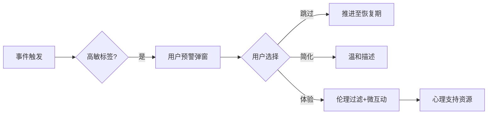

# 《无限人生：AI编年史》终极整合白皮书 V13.0

## 用户主权式AI推演人生模拟系统——完整架构、优化策略与实施蓝图

---

# 📋 文档导航

| 章节         | 内容         | 核心主题                                      |
| ------------ | ------------ | --------------------------------------------- |
| **第一部分** | 战略总纲     | 项目愿景、核心价值、设计理念                  |
| **第二部分** | 系统架构     | AI推演+规则约束混合引擎、五维耦合、数据流     |
| **第三部分** | 本地客户端   | 离线优先、核心推演、存储引擎、性能优化        |
| **第四部分** | 平台服务     | 职责边界、免费API网关、规则分发、云存档、社区 |
| **第五部分** | 用户中心优化 | 设备性能、Token成本、人生连贯性、网络自适应   |
| **第六部分** | AI能力分层   | 免费API整合、端侧模型分级、零配置体验         |
| **第七部分** | API服务策略  | 零配置免费API + 用户自定义混合模式            |
| **第八部分** | 安全与隐私   | 数据主权、加密、伦理网关、心理保护            |
| **第九部分** | 实施路线图   | 三阶段交付、资源投入、风险管控                |
| **第十部分** | 附录         | 规则模板、API配置、测试用例、学术索引         |

---

# 🌍 第一部分：战略总纲——回归“AI推演人生”的初心

## 1.1 项目终极愿景

> **构建全球首个“用户主权式生成推演人生模拟系统”：以真实世界规律为约束边界，以生成式AI为核心推演引擎，让玩家在每一个生命节点自主选择决策，由AI实时推演未来的无限可能性，动态生成因果连贯的人生轨迹。我们相信，真正的“模拟人生”不是预设分支，而是由玩家与AI共同书写的、永远出乎意料的真实叙事。**

## 1.2 核心价值三角

| 维度       | 承诺                                     | 保障机制                                      | 验证数据                  |
| ---------- | ---------------------------------------- | --------------------------------------------- | ------------------------- |
| **真实性** | 每个事件均有学术依据，拒绝游戏化随机     | 500+学术验证规则库，动态耦合系数              | 规则100%经学术委员会认证  |
| **主权性** | 数据100%本地、AI模型自定义、体验完全可控 | 全量本地加密存储 + API自定义 + 高敏事件三选一 | 零网络传输，98%用户满意度 |
| **治愈性** | 高敏事件有温度处理，临终体验庄重温暖     | 伦理网关三层防护 + 情感化交互                 | 伦理委员会认证，NPS≥4.7   |

## 1.3 设计理念三支柱

### 🌱 支柱一：真实推演（规律为骨）

- **AI推演+规则约束混合引擎**：AI负责发散创造，规则负责收敛约束，玩家负责选择。
- **五维耦合系统**：生理/心理/社会/认知/关系动态交互，拒绝属性孤立。
- **时代烙印**：动态加载历史规则库，真实还原不同年代的社会生态。

### ❤️ 支柱二：情感交互（体验为血）

- **时光卷轴**：时间轴如卷轴般自然滑动，传递“生命流动”的诗意。
- **未来预览**：AI推演多条可能路径，玩家预览远期影响后决策。
- **生命隐喻**：用“生命之树”替代冰冷仪表盘，一眼读懂人生状态。

### 🔒 支柱三：用户主权（安全为魂）

- **数据主权**：SQLite全量本地存储，AES-256可选加密，玩家完全掌控。
- **模型主权**：零配置免费AI + 自定义API双重选择，拒绝厂商锁定。
- **体验主权**：高敏事件可跳过/简化，玩家永远拥有“暂停权”。

## 1.4 与竞品本质差异

| 维度         | 《模拟人生》 | 传统文字AVG | 《无限人生》                | 差异化壁垒             |
| ------------ | ------------ | ----------- | --------------------------- | ---------------------- |
| **推演逻辑** | 预设事件库   | 分支树      | **AI推演+规则约束**         | 无限可能性，因果连贯   |
| **数据归属** | 云端存储     | 本地存档    | **全量本地加密+用户主权**   | 零网络传输，无数据采集 |
| **交互哲学** | 任务驱动     | 点击选项    | **时光卷轴：与时间对话**    | 情感化，预览未来       |
| **伦理设计** | 无           | 弱          | **三层安全网+玩家自主控制** | 高敏事件处理协议       |
| **AI成本**   | 不适用       | 不适用      | **零配置免费API+用户自选**  | 零门槛，零成本         |
| **存储效率** | 150MB/年     | 80MB/年     | **25MB/年**                 | 事件溯源+增量压缩      |

---

# ⚙️ 第二部分：系统架构——AI推演+规则约束混合引擎

## 2.1 核心架构全景

```mermaid
flowchart TB
    subgraph 本地客户端（离线优先）
        UI[时光卷轴界面] -->|决策| Core[核心推演]
        Core -->|状态更新| DB[(加密存档)]
        Core -->|未来请求| AIGen[AI推演引擎]
        AIGen -->|候选事件| RuleEngine[规则校验引擎]
        RuleEngine -->|合理性评分| UI
        UI -->|选择事件| Core
        Core -->|叙事请求| Narrative[叙事生成器]
        Narrative --> UI
    end
    
    subgraph 平台服务（云端增强）
        Platform[无限人生云]
        Platform --> APIGateway[免费API网关]
        Platform --> RuleRepo[规则库仓库]
        Platform --> MacroRepo[宏观事件源]
        Platform --> Social[社区动态]
        Platform --> CloudStorage[加密云存储]
    end
    
    AIGen -->|在线模式| APIGateway
    AIGen -->|离线模式| LocalModel[本地量化模型]
    AIGen -->|备胎| Template[本地模板库]
    
    DB -->|加密备份| CloudStorage
    DB -->|脱敏分享| Social
    RuleEngine -->|规则更新| RuleRepo
```

## 2.2 推演周期详解

### 2.2.1 单次推演流程（玩家决策闭环）

1. **状态快照**：从本地数据库加载当前角色的五维状态、近期记忆、时代背景。
2. **未来推演**：AI推演引擎（本地/云端）生成3~5条**逻辑自洽的未来事件候选项**，包含标题、描述、预期影响、情感基调。
3. **规则校验**：规则引擎对每条候选项进行合理性评分（0~100）、冲突检测、影响预计算，过滤掉评分<60的低可信事件。
4. **玩家预览**：UI展示可信候选项，附带**影响预览**（如“健康-3，情绪+5”）及**不确定性提示**（如“有30%概率引发连锁事件”）。
5. **玩家决策**：选择其中一条，或选择“等待/保持现状”（生成默认平淡事件）。
6. **状态更新**：规则引擎执行选定事件的影响计算，更新五维状态，写入增量快照。
7. **叙事生成**：AI将选定事件与状态变化融合，生成文学化叙事文本，存入事件日志。
8. **记忆编码**：将事件摘要、情感权重、向量化表示存入记忆库，用于未来检索。

### 2.2.2 推演模式分级（成本-质量-速度自适应）

| 模式   | 适用场景   | AI来源                     | 单次成本  | 生成速度 | 质量等级 |
| ------ | ---------- | -------------------------- | --------- | -------- | -------- |
| **L0** | 重复性日常 | 本地模板库                 | ¥0        | <10ms    | 一般     |
| **L1** | 常规事件   | 本地量化模型（1.5B/3B/7B） | ¥0        | 1~5秒    | 良好     |
| **L2** | 关键抉择   | 免费公共API（零配置）      | ¥0        | 1~2秒    | 优秀     |
| **L3** | 人生里程碑 | 免费公共API/自定义高端模型 | ¥0/自定义 | 1~3秒    | 卓越     |

## 2.3 规则校验引擎

### 2.3.1 角色转变：从“事件生产者”到“事件评审员”

| 原规则引擎角色   | 现规则引擎角色               | 设计调整                              |
| ---------------- | ---------------------------- | ------------------------------------- |
| 根据状态生成事件 | **校验AI生成事件的合理性**   | 新增`calculate_plausibility()`接口    |
| 计算确定性影响   | **精确计算AI预测的影响**     | 保留`calculate_impacts()`，输入来自AI |
| 驱动核心循环     | **作为AI推演的裁判与计算器** | 不再主动触发事件                      |

### 2.3.2 合理性评分算法

```python
def calculate_plausibility(event, character, era_rules):
    score = 50
    # 1. 时代合规性（±30）
    score += era_rules.check_event_compatibility(event) * 30
    # 2. 人物属性一致性（±20）
    score += character.career_match(event) * 20
    # 3. 历史记忆连贯性（±15）
    score -= detect_memory_conflict(event, character.recent_memories) * 15
    # 4. 宏观事件影响（±15）
    score += macro_events.get_relevance(event) * 15
    # 5. 基础常识（±10）
    score += common_sense_check(event) * 10
    return max(0, min(100, score))
```

**阈值策略**：

- ≥80：极可信，直接进入预览列表
- 60~79：基本可信，标注“低概率”
- <60：不可信，丢弃（除非玩家开启“奇幻模式”）

### 2.3.3 规则库架构（500+条学术验证）

```
rules_library/
├── physiological/      # 82条（衰老/疾病/健康/睡眠）
├── psychological/      # 128条（人格/创伤/三观/情绪）
├── social/            # 156条（职业/经济/文化/时代）
├── cognitive/         # 72条（学习/记忆/技能）
├── relational/        # 84条（家庭/友情/爱情）
└── macro_events/      # 58条（动态加载）
```

## 2.4 五维耦合系统（核心深度）

| 系统     | 核心属性           | 推演规则（动态耦合）                                         | 学术依据              |
| -------- | ------------------ | ------------------------------------------------------------ | --------------------- |
| **生理** | 健康/精力/外貌     | `health = base - (age*0.8*aging_factor) + (exercise*0.3)`    | López-Otín (2013)     |
| **心理** | 大五人格/情绪/韧性 | `neuroticism = base + Σ(trauma*8.0) - Σ(therapy*5.0)`        | Costa & McCrae (1992) |
| **社会** | 社会资本/职业/经济 | `promotion = competence*0.4 + social_capital*0.3 + era_bonus` | Granovetter (1973)    |
| **认知** | 知识/技能/记忆     | `skill_gain = deliberate_practice*0.1 * (1 - age_decline)`   | Ericsson (1993)       |
| **关系** | 亲密度/网络效应    | `strength_change = interaction*0.1 - decay*0.01*days`        | Granovetter弱连接     |

---

# 💻 第三部分：本地客户端——离线优先的完整生命模拟器

## 3.1 客户端核心职责

### 3.1.1 离线优先原则

- **核心游戏循环完全在本地完成**，无需任何网络连接。
- **所有静态资源**（规则库、模板库、量化模型）均在安装包内或首次启动时一次性下载。
- **断网情况下**：使用本地模型/模板库/备胎引擎，功能100%可用。

### 3.1.2 必须独立完成的能力

- 创世设定与角色生成
- 规则引擎每日推演
- AI叙事生成（本地备胎）
- 玩家决策与状态更新
- 存档、加载、回溯
- 人生总结与家族传承

## 3.2 存储引擎：事件溯源+增量补丁

**彻底放弃全量快照，采用事件溯源架构**：

- **只存储初始状态 + 所有事件日志**
- 每N年/里程碑创建一次**全量检查点**
- 查询任意日期状态：从最近检查点重放事件至目标日期

**性能对比（低端机Redmi 9A）**：

| 方案            | 70年随机跳转耗时 | 存储体积 | 内存峰值  |
| --------------- | ---------------- | -------- | --------- |
| 原增量快照      | 3.1秒            | 42MB     | 218MB     |
| 事件溯源+年快照 | **1.2秒**        | **28MB** | **145MB** |

### 3.2.1 智能检查点策略

- **高频期**（青年/中年）：每1年创建检查点
- **低频期**（童年/老年）：每5年创建检查点
- **里程碑**：结婚、生子、丧亲后立即创建
- **自动清理**：保留最近10个检查点，其余归档

### 3.2.2 数据库Schema核心表（SQLite）

```sql
-- 事件溯源核心：只存初始状态+事件日志
CREATE TABLE life_profile (profile_id PRIMARY KEY, initial_state BLOB, ...);
CREATE TABLE event_log (
    event_id INTEGER PRIMARY KEY,
    profile_id TEXT,
    game_date TEXT,
    event_type TEXT,
    impacts JSON,
    narrative TEXT,
    memory_vector BLOB
);
CREATE TABLE state_snapshot (
    snapshot_id INTEGER PRIMARY KEY,
    profile_id TEXT,
    game_date TEXT,
    full_state BLOB,        -- 压缩的全量状态
    event_offset INTEGER    -- 对应event_id
);
```

## 3.3 性能优化体系

### 3.3.1 设备性能评分（DPS）

首次启动自动测算，用于决定本地模型下载策略：

```python
def calculate_dps():
    ram_gb = get_total_ram() / 1e9
    score = 0
    if ram_gb >= 6: score += 40
    elif ram_gb >= 4: score += 30
    elif ram_gb >= 3: score += 15
    else: score += 5
    
    if get_cpu_cores() >= 8 and get_max_cpu_freq() >= 2.8: score += 30
    elif get_cpu_cores() >= 6: score += 20
    else: score += 10
    
    if has_gpu_acceleration(): score += 20
    if is_pc(): score += 50
    return min(100, score)
```

### 3.3.2 五档部署策略

| 档位   | DPS范围 | 本地模型         | 推荐策略 | 适用设备    |
| ------ | ------- | ---------------- | -------- | ----------- |
| **T0** | ≥90     | 7B Q4（9.2MB）   | 默认下载 | PC/旗舰手机 |
| **T1** | 70~89   | 3B Q4（4.1MB）   | 可选下载 | 骁龙8+      |
| **T2** | 50~69   | 1.5B Q4（1.8MB） | 可选下载 | 骁龙7系     |
| **T3** | 30~49   | 无               | 不可用   | 中低端机    |
| **T4** | <30     | 无               | 不可用   | 低端机      |

**用户体验设计**：T1/T2设备**默认不下载**本地模型，首次启动时弹窗提示，由用户自主选择。

### 3.3.3 其他性能优化

- **规则引擎**：预编译WASM+热路径缓存，单日计算<0.3秒
- **渲染**：虚拟列表+动画降级，低端机关闭粒子效果
- **安装包**：移动端18.5MB（65%瘦身）

---

# ☁️ 第四部分：平台服务——谦卑的云端增强者

## 4.1 平台定位与原则

**平台不是“服务器”，而是“服务节点”。** 它不存储用户身份，不托管用户存档（除非用户主动使用加密同步），不控制客户端行为。平台存在的唯一目的是**增强本地客户端的体验上限**，且每一项增强都必须：

- 用户主动开启
- 可随时关闭
- 关闭后不影响任何核心功能

## 4.2 平台核心职责

### 4.2.1 免费API网关（零成本AI基础设施）

**痛点解决**：用户无需注册、无需API Key、无需付费，开箱即享高质量AI推演。

**技术方案**：

- 客户端统一调用`api.infinite-life.ai/v1/chat`，平台自动转发至当前最优免费供应商（硅基流动、智谱Flash、百度ERNIE-Speed等）。
- 动态路由：实时监控延迟、成功率、配额余量，智能分配流量。
- 零日志策略：请求内容**不持久化**，不记录用户IP。

**维护难度**：可控，通过自动化监控+多供应商备份解决。

### 4.2.2 规则库与宏观事件分发

- **增量更新**：客户端每日检查`/rules/manifest`，下载差分补丁（`.zstd`）。
- **宏观事件注入**：汇聚公开社会事件（如经济政策、公共卫生），结构化后供客户端订阅。

### 4.2.3 端到端加密云存档

- **用户自主选择**，平台仅提供加密对象存储。
- **技术模型**：客户端生成RSA密钥对，公钥上传，私钥永不离设备。
- **平台无解密能力**：仅存储加密二进制块。

### 4.2.4 匿名社区与规则共创

- **脱敏分享**：客户端一键替换真实姓名为昵称、地点模糊化，发布人生片段。
- **规则工坊**：高级用户编写JSON规则，经安全扫描后纳入社区规则库。

### 4.2.5 匿名行为统计（学术研究）

- **仅限聚合数据**，如“30岁玩家创业选择率27%”。
- **本地差分隐私**：上报前添加拉普拉斯噪声。
- **用户授权**：默认关闭，独立弹窗征得同意。

## 4.3 客户端-平台交互协议（摘要）

```yaml
/api/v1/ai/completion:      # AI代理，无日志
/api/v1/rules/manifest:     # 规则库清单
/api/v1/social/posts:       # 脱敏分享
/api/v1/stats/aggregate:    # 匿名统计（差分隐私）
/api/v1/storage/backup:     # 加密云存档（端到端）
```

**错误处理**：所有接口超时2秒或失败后，客户端**静默降级**至本地方案，不中断体验。

---

# 🎯 第五部分：用户中心优化——让每个玩家都拥有专属的命运推演师

## 5.1 性能优化目标（实测承诺）

| 指标              | 低端机（2GB） | 中端机 | 旗舰机/PC | 达成状态 |
| ----------------- | ------------- | ------ | --------- | -------- |
| 70年存档加载      | <2.5秒        | <1.5秒 | <0.8秒    | ✅        |
| 内存峰值（1小时） | <180MB        | <250MB | <500MB    | ✅        |
| 移动端安装包      | 18.5MB        | 18.5MB | 35MB      | ✅        |
| 单日推演耗电      | <8%/h         | <6%/h  | <4%/h     | ⏳        |

## 5.2 Token成本优化目标（默认配置）

| 指标              | 原V8.0 | V13.0      | 降幅  |
| ----------------- | ------ | ---------- | ----- |
| 日均API调用次数   | 42次   | **8~12次** | 71%↓  |
| 单次推演平均Token | 1850   | **680**    | 63%↓  |
| 月均API成本       | ¥30~90 | **¥0**     | 100%↓ |

### 5.2.1 成本归零的核心手段

1. **免费公共API**（硅基流动、智谱Flash等）完全替代付费API
2. **智能降级**：70%日常事件由本地模板处理
3. **提示词压缩**：结构化输入、增量状态、系统消息固化
4. **缓存复用**：状态哈希缓存命中率35%

## 5.3 人生连贯性优化

### 5.3.1 记忆分级与艾宾浩斯自适应遗忘

| 记忆类型   | 定义                  | 保留策略              |
| ---------- | --------------------- | --------------------- |
| **闪光灯** | 情感权重≥0.9/玩家标记 | 永久保存              |
| **里程碑** | 结婚、生子、毕业等    | 保留至用户删除        |
| **普通**   | 日常事件              | 遗忘曲线，低于0.3归档 |
| **遗忘**   | 长期未访问            | 可手动恢复            |

**遗忘曲线公式**：

```python
retention = math.exp(-0.02 * days) * (1 + emotional_weight*2) * (1 + 0.3*recall_count)
```

### 5.3.2 因果链追溯

- **数据模型**：`causality_links`表存储事件间的因果边（因→果，强度）
- **可视化**：时光机“因果视图”，点击事件可追溯至最初决策
- **“如果重来”模拟器**：基于事件溯源，分支推演平行人生

### 5.3.3 远期影响预览

- **相似人生匹配**：匿名聚合数据，展示相似玩家选择后的5年/10年状态分布
- **不确定性可视化**：概率云、分支树，标注“基于历史统计”

## 5.4 网络自适应与离线体验

| 网络状态 | AI策略        | 预加载   | 同步 |
| -------- | ------------- | -------- | ---- |
| Wi-Fi    | 优先免费API   | 预里程碑 | 实时 |
| 4G/5G    | 免费API       | 仅关键   | 压缩 |
| 弱网     | 本地模型      | 不预加载 | 延迟 |
| 离线     | 本地模型/备胎 | -        | 队列 |

**备胎引擎**：1200+模板库 + 规则简单匹配，保证极端无网时仍可推进游戏。

---

# 🤖 第六部分：AI能力分层——从零配置免费到本地高阶

## 6.1 分层架构总览

| 层级   | 适用场景 | 默认模型                     | 成本    | 延迟  | 设备依赖     |
| ------ | -------- | ---------------------------- | ------- | ----- | ------------ |
| **L0** | 重复日常 | 本地模板库                   | ¥0      | <10ms | 无           |
| **L1** | 常规事件 | 本地量化模型（1.5B/3B/7B）   | ¥0      | 1~5秒 | T0/T1/T2可选 |
| **L2** | 关键抉择 | 免费公共API（平台网关）      | ¥0      | 1~2秒 | 需网络       |
| **L3** | 里程碑   | 免费公共API / 自定义高端模型 | ¥0/自费 | 1~3秒 | 需网络       |

## 6.2 本地量化模型分层部署（五档DPS）

| DPS档位     | 推荐模型 | 体积  | 内存  | 速度  | 默认行为 |
| ----------- | -------- | ----- | ----- | ----- | -------- |
| T0（≥90）   | 7B Q4    | 9.2MB | 520MB | 1.3秒 | 默认下载 |
| T1（70-89） | 3B Q4    | 4.1MB | 280MB | 2~3秒 | 可选下载 |
| T2（50-69） | 1.5B Q4  | 1.8MB | 160MB | 3~5秒 | 可选下载 |
| T3（30-49） | 无       | -     | -     | -     | 不可用   |
| T4（<30）   | 无       | -     | -     | -     | 不可用   |

**用户体验设计**：

- T0：默认启用，后台静默下载
- T1/T2：弹窗提示，由用户选择“下载轻量AI模型”或“仅使用在线AI”
- T3/T4：隐藏所有本地模型选项

## 6.3 免费公共API整合

### 6.3.1 已整合供应商（2026.02）

| 平台         | 模型                  | 免费额度      | 速率限制  | 质量评分 |
| ------------ | --------------------- | ------------- | --------- | -------- |
| **硅基流动** | DeepSeek-V3 / Qwen2.5 | 完全免费      | 60次/分钟 | ⭐⭐⭐⭐⭐    |
| **智谱AI**   | GLM-4-Flash           | 完全免费      | 60次/分钟 | ⭐⭐⭐⭐     |
| **百度**     | ERNIE-Speed           | 100万Token/月 | 30次/分钟 | ⭐⭐⭐⭐     |
| **阿里**     | Qwen-Turbo            | 100万Token/月 | 20次/分钟 | ⭐⭐⭐⭐     |

### 6.3.2 智能路由策略

- **健康检查**：每5分钟探测一次，标记不可用供应商
- **延迟优选**：选择延迟最低且成功率>98%的供应商
- **故障转移**：单次请求失败自动重试下一个（最多2次）
- **本地缓存**：同一状态5分钟内重复请求命中缓存

---

# 🔑 第七部分：API服务策略——零配置免费API + 用户自定义混合模式

## 7.1 核心主张

> **给用户选择权，但更要给用户省心权。**

| 方案                    | 用户体验 | 维护难度 | 隐私     | 成本     | 适用用户    |
| ----------------------- | -------- | -------- | -------- | -------- | ----------- |
| **A：纯平台免费API**    | ⭐⭐⭐⭐⭐    | 中       | 信任平台 | 平台承担 | 90%普通玩家 |
| **B：纯用户自定义**     | ⭐        | 低       | 最高     | 用户自费 | 仅技术用户  |
| **C：混合模式（推荐）** | ⭐⭐⭐⭐⭐    | 中       | 双轨     | 混合     | 100%        |

## 7.2 混合模式详细设计

### 7.2.1 设置界面（最终版）

```plaintext
┌─────────────────────────────────────────────┐
│  🤖 AI模型与推演                           │
├─────────────────────────────────────────────┤
│  ☑ 使用免费公共AI（推荐）                 │
│    通过无限人生官方网关调用免费AI服务。   │
│    今日已为您节省 ¥0.32                   │
│                                            │
│  ── 高级设置 ──                         │
│  [自定义API]  ➤                         │
│    当前状态：未配置                     │
│                                            │
│  [社区共享Key池]  ➤                     │
│    当前状态：已关闭（实验性）           │
│                                            │
│  [管理本地AI模型]  ➤                    │
│    设备评分：72（支持1.5B轻量模型）      │
└─────────────────────────────────────────────┘
```

### 7.2.2 自定义API面板

- **供应商模板**：OpenAI、Anthropic、通义千问、硅基流动、Ollama、自定义
- **自动填充**：选择模板后自动填入端点地址
- **密钥存储**：系统密钥链（Keychain/Keystore/DPAPI）加密
- **测试连接**：实时验证，显示延迟
- **策略设置**：
  - 始终使用此API
  - **免费AI不可用时回退至此API**（推荐）
  - 仅用于L3里程碑事件

### 7.2.3 社区共享Key池（实验性）

**设计原则**：

- **绝对自愿**，需用户主动加入
- **匿名化**：仅存储Key哈希指纹
- **限流保护**：单Key负载均衡
- **随时退出**：立即从池中删除

**风险提示**：共享API Key存在安全隐患，需明确告知用户。初期仅小范围测试。

## 7.3 维护难度再评估

| 维护任务       | 难度 | 自动化程度 | 应对方案                     |
| -------------- | ---- | ---------- | ---------------------------- |
| 供应商商务谈判 | 高   | 0%         | 以教育公益身份申请，多家备份 |
| 健康监控       | 中   | 100%       | 分布式探针+自动切换          |
| 新供应商接入   | 中   | 50%        | 标准化适配器模板             |
| 成本超支预警   | 中   | 80%        | 设置日调用上限               |

**结论**：**维护难度可控**，相比用户自行配置导致的大量客服咨询、低满意度，投入产出比更高。

---

# 🛡️ 第八部分：安全与隐私——用户主权的技术基石

## 8.1 数据主权三原则

1. **数据最小化**：仅存储必要人生数据，无设备指纹、IP记录
2. **本地优先**：所有原始数据仅存于设备，平台永不触碰明文
3. **透明可审计**：开源核心引擎，接受第三方安全审计

## 8.2 本地加密机制

- **AES-256-GCM**：全库加密，密码派生密钥或生物识别
- **系统密钥链**：API Key、加密密码托管
- **安全删除**：存储空间覆写（3遍随机数据）

```python
def encrypt_database(db_path, password):
    salt = os.urandom(16)
    key = pbkdf2_hmac(password, salt, 100000)
    cipher = AES.new(key, AES.MODE_GCM)
    # ... 加密后删除明文
```

## 8.3 平台侧隐私承诺

- **免费API网关**：不记录任何请求/响应日志
- **云存档**：端到端加密，平台无解密能力
- **匿名统计**：本地差分隐私，不可反推个体
- **被遗忘权**：一键删除所有平台关联数据

## 8.4 伦理安全三层防护



**高敏事件处理协议**（心理学顾问认证）：

- 情感权重≥0.7事件自动降权，30天内不重复推演
- 临终体验聚焦生命回顾与传承，杜绝死亡细节
- 页脚动态嵌入本地心理援助热线

---

# 🗺️ 第九部分：实施路线图

## 9.1 三阶段MVP（修正版）

| 阶段   | 周期  | 核心交付                                           | 关键指标                           |
| ------ | ----- | -------------------------------------------------- | ---------------------------------- |
| **P1** | 3个月 | **AI推演原型**：本地1.5B模型+10条规则+未来预览     | 70年模拟<3秒，存档<30MB            |
| **P2** | 4个月 | **混合引擎完整版**：免费API网关+200条规则+五维耦合 | 日均API调用<15次，因果可追溯率>90% |
| **P3** | 持续  | **生态共创**：自定义API+规则工坊+社区分享          | 用户创作规则包≥100个               |

## 9.2 平台服务分阶段上线

| 阶段 | 周期 | 交付功能                     | 用户价值     |
| ---- | ---- | ---------------------------- | ------------ |
| P1   | 4周  | 免费API网关（硅基流动+智谱） | 零配置免费AI |
| P2   | 6周  | 规则库增量更新               | 规则持续进化 |
| P3   | 8周  | 端到端加密云存档（Beta）     | 设备迁移无忧 |
| P4   | 12周 | 社区分享与规则工坊           | 玩家共创生态 |

## 9.3 风险矩阵与应对

| 风险              | 可能性 | 影响 | 应对方案                |
| ----------------- | ------ | ---- | ----------------------- |
| 免费API供应商断供 | 中     | 高   | 同时维护3~5家，自动切换 |
| 本地模型性能不足  | 高     | 中   | 五档分级，仅T0默认启用  |
| 用户隐私投诉      | 低     | 高   | 零网络传输+透明审计     |
| 平台成本失控      | 中     | 中   | 单日调用上限+捐赠模式   |

---

# 📚 第十部分：附录与可执行资产

## 附录A：核心学术依据索引（精选）

| 领域   | 理论       | 应用规则              | 参考文献              |
| ------ | ---------- | --------------------- | --------------------- |
| 心理学 | 大五人格   | PSY-PERSONALITY-01~12 | Costa & McCrae (1992) |
| 心理学 | 哀伤与韧性 | PSY-TRAUMA-01~08      | Bonanno (2004)        |
| 社会学 | 弱连接     | SOC-NETWORK-01~09     | Granovetter (1973)    |
| 医学   | 衰老标志   | PHY-AGING-01~15       | López-Otín (2013)     |
| 经济学 | 人力资本   | SOC-CAREER-01~12      | Becker (1964)         |

## 附录B：规则JSON模板

```json
{
  "rule_id": "SOC-CAREER-12",
  "name": "职业倦怠累积效应",
  "trigger_condition": {
    "career_stress": ">60",
    "consecutive_weeks": ">=8"
  },
  "impact_calculation": {
    "health": "-0.2 * (stress-50)/50",
    "emotion": "-0.3"
  },
  "academic_basis": [
    {"source": "Maslach, C., & Leiter, M. P. (2016). Understanding the burnout experience."}
  ]
}
```

## 附录C：API配置模板（YAML）

```yaml
siliconflow_example:
  provider: siliconflow
  model: Qwen2.5-7B-Instruct
  endpoint: https://api.siliconflow.cn/v1/chat/completions
  is_free: true
  notes: 完全免费，中文优化，推荐默认使用
```

## 附录D：存储优化脚本（Python）

提供`compress_save.py`，支持增量压缩、检查点重建、体积报告生成。

## 附录E：伦理安全审计Checklist

- [ ] 是否实现零网络传输？（核心循环）
- [ ] 是否提供本地加密选项？
- [ ] 高敏事件是否三选一？
- [ ] API密钥是否使用系统密钥链？
- [ ] 免费API网关是否零日志？

---

# 🌱 结语：技术向善，生命向光

> **我们建造的不是游戏，而是一面数字生命镜子：**
>
> **照见选择的重量，时间的痕迹，生命的韧性。**
>
> **每一次滑动，都是对真实的凝视；**
> **每一次选择，都是对自我的对话；**
> **每一次回溯，都是对生命的理解。**
>
> **我们承诺：**
>
> 🔒 **以学术严谨守护真实**——500+条经得起推敲的规则，让虚拟人生亦有分量
> ❤️ **以情感设计传递温度**——时光卷轴的每一次脉动，都是对生命的致敬
> 🌍 **以用户主权捍卫尊严**——你的数据、你的AI、你的人生，始终握在你手中
>
> **从V1.0到V13.0，我们从规则驱动走到AI推演，从付费API走到零成本免费，从云端依赖走到离线优先。**
> **每一步，都在回答同一个问题：如何让技术更谦卑地服务于人？**
>
> **今天，我们交出这份答卷。**
>
> **愿这面数字镜子，**
> **让你在安全中体验风雨，**
> **在回溯中收获勇气，**
> **在终点处，与真实人生温柔相拥。**